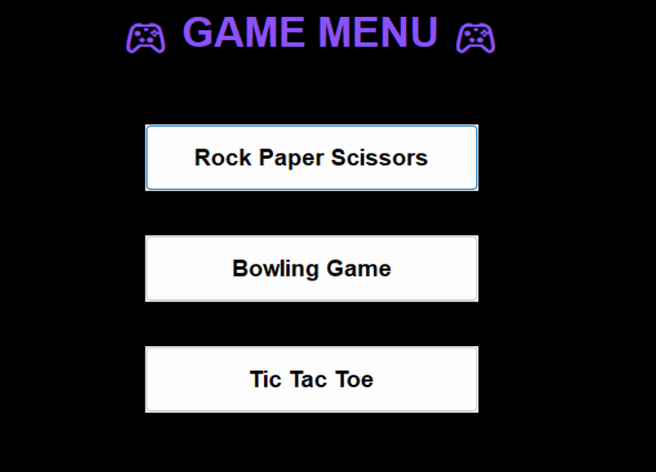
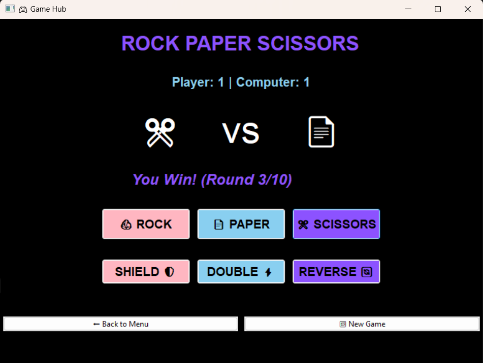
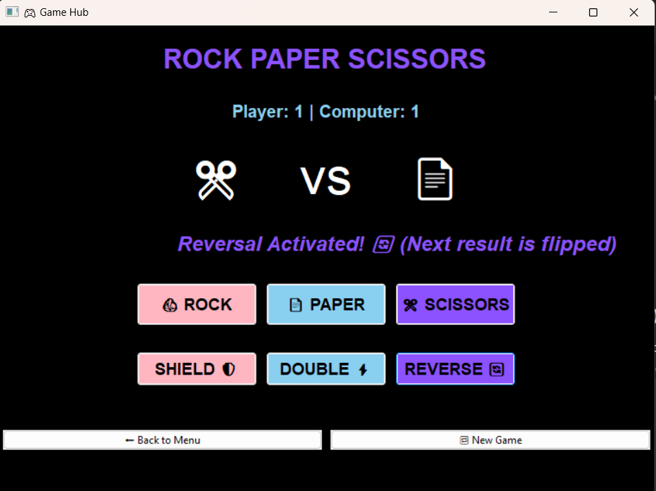
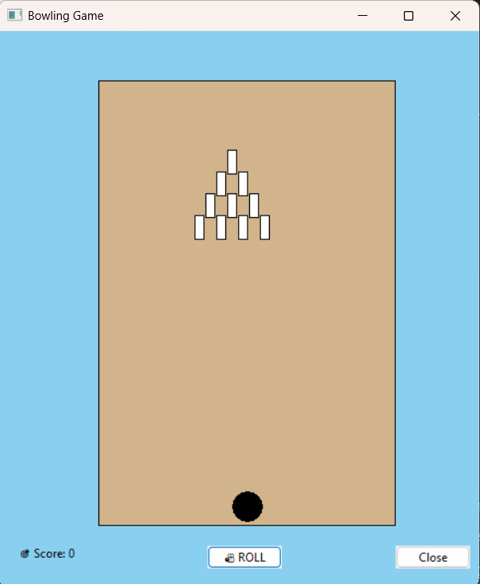
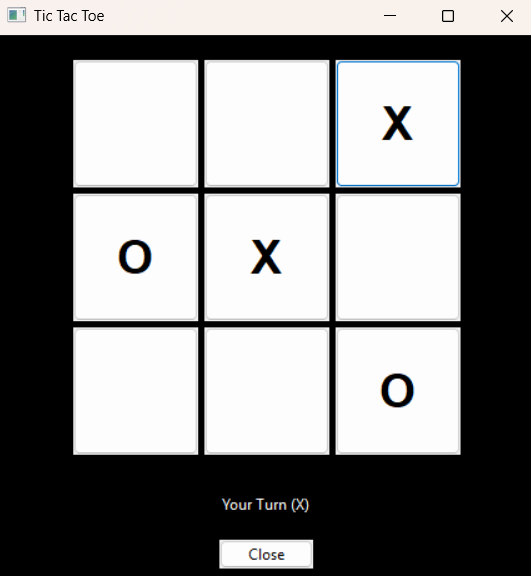

Game Hub 

Game Hub is a Python-based desktop application that provides a centralized platform to play multiple mini-games through a graphical user interface. The project demonstrates event-driven programming, GUI design, and modular game development using wxPython and pygame.

 Games Included

 1️⃣ Rock Paper Scissors (Enhanced)
- 10-round match system
- Player vs Computer
- Score tracking
- **Power-ups system**
  - 🛡 Shield (blocks a loss)
  - ⚡ Double Attack (double points on win)
  - 🔄 Reverse (reverses the outcome)
- Cooldown mechanism for power-ups
- Sound effects for win, loss, tie, and power-ups

 2️⃣ Tic Tac Toe
- Player vs Computer
- Simple AI using random valid moves
- Win and draw detection
- Clean 3×3 grid UI
- Sound effects and status updates

 3️⃣ Bowling Game
- Animated bowling ball movement
- Randomized pin knockdown logic
- Score tracking
- Simple 2D drawing using wxPython paint events

 Key Concepts Used

- Object-Oriented Programming (OOP)
- Event-driven programming
- GUI development using wxPython
- Audio handling using pygame
- Game state management
- Modular design for multiple games
- Timers and animations
- Error handling for optional features (sound)

 Technologies Used

- Python 3
- wxPython – GUI framework
- pygame – Audio effects
- Random module – Game logic
- OS & SYS modules – File handling

  ## 📸 Sample Input / Output Screenshots

Game Menu (Input: Game Selection)

Rock Paper Scissors – Gameplay Output

Rock Paper Scissors – Power-Up Activated

Bowling Game – Ball Roll & Score Output

Tic Tac Toe – Player vs Computer Output

Save the python file and the audio files in the same folder for the game to work seamlessly.
